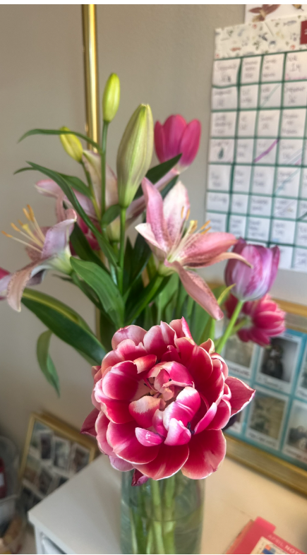

# What's On Saachi's Desktop?

## Dek

Saachi's AI stack is less a neat list of tools than a personal operating loop for moving from idea to structure to artifact to system to story.

## Quick Stats

- Name: Saachi Gupta
- Current Mood: Tender command center
- Daily Driver: ChatGPT, Claude, PowerPoint
- Emotional Support Tab: ChatGPT
- Always Open: Outlook, LinkedIn, OneNote
- Visual Thesis: Systems with souvenirs
- Stack Thesis: Idea -> structure -> artifact -> system -> story

## Intro

Saachi's desk is not trying to look minimal. It is trying to hold momentum.

There are the obvious work surfaces: two monitors, a laptop, Outlook, LinkedIn, OneNote, browser tabs, job documents, and a mountain wallpaper that makes the whole setup feel like it is secretly pointed toward a trailhead. Then there is the softer evidence around the screens: illustrated cards, handwritten reminders, adventure checklists, pens, a water cup, loose paper, and the small physical objects that make a digital system feel less sterile.

The same thing is happening in the tech stack. On paper, it includes ChatGPT, Claude, PowerPoint, Perplexity, Astro, GitHub, Netlify, Python scripts, APIs, logs, and a growing set of personal files. In practice, it is not a conventional software stack. It is a way of moving through work.

Saachi uses AI to get from the messy beginning to the thing she can actually show someone. A thought becomes a prompt. A prompt becomes a structure. The structure becomes a deck, page, app, email, dashboard, event concept, or system. Then the artifact gets edited until it has taste, context, and a reason to exist.

The stack is not just "I use ChatGPT." It is idea -> structure -> artifact -> system -> story.

## The Stack

## What I Use, What I Use It For

| Layer | Tools | What I use it for |
| --- | --- | --- |
| Thinking / writing | ChatGPT | Job search strategy, emails, texts, interview prep, legal/HR framing, company research, event concepts, product strategy, debugging my own thinking, turning messy notes into structure. |
| Building / coding | Claude, Claude Code, VS Code | Website work, workflow automation, creative projects, coding support, job-search systems, event or pipeline systems, and making ideas into files. |
| Final artifacts | PowerPoint, PPTX, HTML/CSS slides, PDF export | Decks, mock QBRs, customer-facing narratives, metrics pages, slide-by-slide storytelling, talk tracks, and final polish. |
| Research | Perplexity, Deep Research, NotebookLM | Company research, market mapping, strategic finance research, AI/startup hiring trends, and getting oriented quickly in unfamiliar spaces. |
| Owned web presence | Astro, Markdown, GitHub, Netlify, `saachigupta.net` | Publishing projects, writing, builds, reflections, adventures, and portfolio-worthy proof of work. |
| Fast prototypes | Bolt, Lovable, Replit/Glitch-style apps | One-hour builds, beginner AI apps, playful event tools, adventure planners, mood/productivity apps, and quick demos. |
| Automation / tiny infra | Python, Claude hooks, cron tasks, `jobs.saachigupta.net/api`, custom job dashboard | Dashboard syncs, job tracking, WA unemployment logging, recurring updates, and tools that persist across sessions. |
| Memory / ops | `brain.md`, `ai-learning-log.md`, WA Unemployment Log, loop files, LinkedIn, WhatsApp, calendar systems | Follow-ups, leads, recruiter touchpoints, tasks, personal notes, operating rituals, and human coordination. |
| Outdoor/product data | NPS API, OpenRouteService, geocoding, Leaflet/OpenStreetMap, AQI/wildfire/water/trail/permit data | Adventure planning, map-based product ideas, trip logistics, trail discovery, and outdoor tools. |

## Adoption Timeline

### Phase 1 — Skill foundations (Feb-Mar 2026)

The base product was the interview coach skill, built and refined from February 19 through March 26 with dozens of commits adding workflows, coaching depth, memory, and commands.

Then the first external system appeared: on March 3, `jobs.saachigupta.net` started as a FastAPI + PostgreSQL dashboard. On March 4, Gmail auto-scan, lead creation from email, and a scan review modal made the job-search system more than a spreadsheet.

March is also when custom skills became a pattern. `/availability` arrived on March 21. `/text-respond` and `/swim` followed on March 26.

The key shift: AI stopped being only a chat window and started becoming named workflows.

### Phase 2 — Dashboard matures + first automation (Apr 1-14)

April started with expansion. `/hinge` appeared on April 1. April 4 was the biggest infrastructure day: `/updates`, an Interviews tab, Pipeline Gantt, dedup agent, coach sync agent, Bearer auth to the API, and a mobile ingest page.

On April 6, `/brain` became the universal capture layer. By April 13 and 14, the system was being cleaned and enriched: Gmail scan fixes, Amazon tab cleanup, and interview coach content loaded with personal Amazon examples.

The key shift: the dashboard became a living operating surface, not just a place to view leads.

### Phase 3 — Agentic work + accountability (Apr 17-30)

The Resolve AI QBR take-home was the first major proof point: eight-plus sessions iterating slides, then a critique agent built to evaluate the presentation. This was AI doing actual work on an output, not just responding to prompts.

On April 24, the compensation negotiation skill expanded the skill surface. April 28 brought more dashboard cleanup and Bearer auth on lead endpoints. April 29 added a job search accountability system. April 30 added scheduled job-search logging and a floating TODO widget.

The key shift: AI became a coach and accountability layer, not only a helper.

### Phase 4 — Systems layer (May 1-9)

May is when the system started wiring itself together.

May 1 added job updates from email scraping. May 3 documented the weekly unemployment claim process, laying groundwork for `/log-job-search`. May 6 added `/ss`, the screenshot skill. May 8 added `/log-job-search` and the WA Log tab in the dashboard, creating a path for AI sessions to write to an external dashboard.

On May 9, the stack crystallized: `sync-dashboard.py`, a Stop hook that triggers dashboard sync at session end, `/ai-log`, an AI learning log, and a memory system that persists behavioral config across sessions.

The key shift: session end became an event. The AI system was no longer just helping inside a chat; it was triggering downstream syncs, writing logs, and tracking its own evolution.

### The short arc

| Date | Milestone | Level |
| --- | --- | --- |
| Feb 19 | Interview coach skill as a tool | 2-3 |
| Mar 3 | Built and deployed external jobs dashboard | 4 |
| Mar 21 | First custom Claude Code skill: `/availability` | 4 |
| Apr 4 | `/updates`, dedup agent, API auth, dashboard expansion | 4 -> 5 |
| Apr 18 | Critique agent for live work output | 5 |
| May 8 | `/log-job-search` writes to WA Log tab | 5 |
| May 9 | Stop hook wires session end to dashboard sync | 5 |
| May 9 | `/ai-log` tracks the stack itself | 5 |

Total span: about 11 weeks from first skill to a full systems layer.

## When I Added What

| Date | Added |
| --- | --- |
| Mar 3 | Jobs dashboard: FastAPI + PostgreSQL, live at `jobs.saachigupta.net` |
| Mar 21 | `/availability` |
| Mar 26 | `/text-respond`, `/swim` |
| Apr 1 | `/hinge` |
| Apr 4 | `/updates`, dedup agent, Bearer API auth |
| Apr 6 | `/brain` |
| May 6 | `/ss` |
| May 8 | `/log-job-search` |
| May 9 | `/ai-log`, Stop hook, `sync-dashboard.py`, memory system |

## What I Use Most

- Interview prep and coaching: by far the most sessions, including Resolve QBR, Ando, Samsara, and Figma.
- Pipeline review: `/updates` runs daily/hourly.
- Job research: company and role analysis across OpenAI, Figma, Samsara, and others.
- LinkedIn and content: profile overhaul, post drafting, and positioning.
- Outreach: `/text-respond` for WhatsApp and email drafts.
- Unemployment tracking: `/log-job-search` weekly.

## What I Get Help With

- Output work: take-home assignments, decks, emails, LinkedIn copy.
- Thinking partner work: role fit, comp strategy, interview angle selection.
- Memory: the system remembers positioning, history, preferences, and prior context.
- Accountability: `/updates` acts like a coach that asks whether the hard things got done.
- Infrastructure: the tools themselves, including skills, hooks, dashboard syncs, and logs.

## Who I Learn From / What I Have Copied

The stack is also a set of people Saachi has learned from, copied, remixed, and turned into her own operating style.

### Hannah Zhang — context files as a personal operating system

The clearest copied pattern is Hannah Zhang's approach to making AI work from a folder of context files: identity, voice, work, personal notes, rules, and skills.

Saachi is taking that idea and making it her own: not just "prompt better," but build a personal context system that any AI tool can read. This shows up in `brain.md`, rules files, skills, loop files, and the desire for a slop cannon that can turn messy dumps into consistent outputs.

What she copied: the idea that good AI output comes from reusable context, not heroic one-off prompting.

### Career Hannah — content that writes itself

Saachi is borrowing from Career Hannah's ability to make career content feel repeatable without feeling dead: a strong hook, a recognizable structure, a specific audience, and enough personal point of view that the format can keep generating.

What she copied: the idea that a strong format is a machine. You do not need to reinvent the frame every time; you need better inputs.

### Allie Miller — AI fluency as public operating style

Allie Miller is part of the influence map because she models AI fluency as something visible, teachable, and career-relevant. She makes AI adoption feel like a professional identity: learn the tools, show the workflow, explain the leverage, make the work legible.

What Saachi copied: treating AI usage itself as a signal. Not just "I used AI," but "here is how I think with it, build with it, and explain it."

### Lenny's interview coach — interview prep as a repeatable system

The Lenny-style interview coach belongs in the stack because it turns interview prep from "think about your experience" into a structured practice loop: identify the role, map the competencies, pressure-test the stories, sharpen the examples, and rehearse the answer until it has a clean arc.

What Saachi copied: treating interview prep like a product surface. The output is not just confidence; it is a bank of stories, frameworks, company-specific angles, and crisp ways to explain what she has done.

### Glossier Top Shelf — intimate inventory as editorial format

The "What's On My Desktop" series borrows directly from the beauty-cabinet interview: what do you reach for every day, what do you swear by, what is overhyped, what is embarrassing, what is secretly essential?

What she copied: the intimacy of asking people about their daily objects instead of their abstract opinions.

### Gabriele Galimberti's Toy Stories — objects as self-portrait

The visual grammar comes from the idea that a person surrounded by their objects can be more revealing than a normal profile.

What she copied: the subject-plus-inventory structure, translated from toys into desktops, tabs, tools, prompts, and rituals.

### Myspace Top 8 / early internet profile culture — ranking as identity

The Top 8 format is not just cute. It is a way of making tool choice feel social and personal. Ranking your tools is ranking your dependencies.

What she copied: using labels, rankings, current moods, and tiny badges as identity signals.

### Vibe coding builders — permission to make scrappy things

Saachi has copied the energy of people who ship weird, small, useful things quickly: one-hour apps, single-purpose tools, playful demos, and "what if this existed?" prototypes.

What she copied: speed as a confidence tool. Make the rough version first; polish after the idea has a body.

### Operators and systems people — turning life into workflows

The job-search dashboards, follow-up systems, CRMs, logs, and runbooks come from watching how operational people make ambiguity trackable.

What she copied: if something matters and repeats, make it visible, routable, and reviewable.

## The Copying Ethic

Saachi's stack is built by copying the useful part, then changing the surface area until it feels like hers.

She copies a workflow, not a personality. A folder structure, not a worldview. A posting format, not a voice. A visual grammar, not a brand.

The result is a stack with citations: a little creator system, a little operator brain, a little deck polish, a little early internet self-expression, a little outdoor product imagination, and a lot of manual taste layered on top.

### 1. ChatGPT — Chief Of Staff

ChatGPT is the general-purpose thinking layer and emotional support tab.

It is where Saachi goes for job search strategy, emails, texts, interview prep, legal and HR framing, company research, event concepts, product strategy, and the extremely underrated task of debugging her own thinking.

The core use case is not simply writing. It is translation: turning a messy internal state into something structured enough to act on. ChatGPT helps make the first version of the thought visible.

### 2. Claude / Claude Code — Builder Identity

Claude is where Saachi increasingly feels like a builder.

Claude Code marks the shift from asking AI for answers to asking AI to help make actual things: personal productivity tools, website work, workflow automation, job-search systems, creative projects, code, folders, and repeatable scaffolds.

If ChatGPT is the chief of staff, Claude is the studio. It is the place where the idea gets files.

### 3. PowerPoint / PPTX + HTML Slides — Final-Form Machine

PowerPoint is still where the work becomes real.

AI can generate structure, copy, screenshots, talk tracks, charts, and draft narratives. But PowerPoint is where the artifact has to become presentable. It is the final QA surface: does the story hold, does the slide look credible, does the output feel like something Saachi would actually send?

This layer includes mock QBRs, customer-facing narratives, metrics pages, HTML/CSS slide layouts, PDF exports, chart screenshots, and slide-by-slide storytelling.

### 4. Perplexity / Deep Research / NotebookLM — Teach Me Fast

This is the research acceleration layer.

Saachi uses it to get oriented quickly: company research, market mapping, strategic finance research, AI and startup hiring trends, and unfamiliar domains where she needs enough context to ask better questions.

The emotional function is confidence. These tools lower the activation energy of entering a new space.

### 5. Astro / GitHub / Netlify / VS Code — Owned Surface

This is the website layer: the part of the stack that turns outputs into an archive.

Rebuilding `saachigupta.net` meant moving from "AI helped me make a thing" to "I have a place where my things can live." Astro, Markdown, VS Code, GitHub, Netlify, HTML/CSS layouts, and site sections like Builds, Learnings, Reflections, and Adventures all sit here.

This layer matters because it gives the work a home.

### 6. Bolt / Lovable / Vibe Coding Tools — Make It Real Fast

This is the playful prototype layer.

It includes the HBS Bolt workshop, Lovable's Women's Day coding event, one-hour builds, single-file app ideas, micro-apps, beginner demos, and the October inflection point where AI started feeling like a way to make things instead of only think about them.

The projects in this layer are scrappy and alive: Halloween Costume Idea Generator, Adventure Planner, Multi-Sport Trail Explorer, playful event apps, mood and productivity tools, vibe pings, energy-based task sorters, and "why am I avoiding this?" bots.

This layer is not polished. That is why it works. It is also the layer where Saachi started seeing AI building as something social: women learning together, people making scrappy first versions, and the workshop format as a confidence engine.

### 7. Python Scripts / Hooks / Cron / APIs — Tiny Infrastructure

This is the automation layer that is starting to creep in.

It includes Saachi's own job dashboard, dashboard syncs, job tracking scripts, Claude hooks, cron tasks, WA unemployment log updates, `jobs.saachigupta.net/api`, and other small systems that make work persist across sessions.

It is not full cloud infrastructure yet. It is more personal than that: tiny infrastructure for one person becoming more automated.

The job dashboard matters because it is not just a place to store information. It is evidence that Saachi started turning an emotionally messy process into something visible, trackable, and reviewable.

### 8. `brain.md` / Logs / CRMs / LinkedIn / WhatsApp — Operating Ritual

This is the coordination layer.

It includes `brain.md`, `ai-learning-log.md`, WA unemployment logs, loop files, job leads, recruiter touchpoints, LinkedIn, WhatsApp, calendar systems, and the human side of the machine.

This is where the stack touches real life: follow-ups, nudges, applications, tasks, people, memory, and the ongoing work of not dropping the thread.

## The Weird Workflow

The workflow is hybrid: AI-heavy generation, then manual polish.

Saachi starts with the mess. A brain dump, screenshot, transcript, idea, anxiety spiral, job posting, deck prompt, or loose phrase goes into an AI tool. The first goal is structure. The second is an artifact. The third is a system that makes the next version easier.

Decks move through AI-assisted iterations, HTML previews, screenshots, talk tracks, and final PowerPoint QA. Website ideas move from prompt to file to local mock to site structure. Job-search work moves from emails and leads into her own job dashboard, logs, follow-ups, and recurring tasks.

The pattern repeats because it works: dump the mess, find the shape, make the thing, then build the system around it.

## Stories Behind The Stack

The stack makes more sense when each tool has a little origin story.

### Adventure identifier / planner

The adventure tools come from a real-life list, not a generic product idea.

Saachi has a Gearhouse bucket list of outdoor activities: the things she wants to try, revisit, train for, plan around, or become the kind of person who does. The adventure identifier / planner comes from that desire to turn a fuzzy outdoor appetite into something more searchable, sortable, and doable.

This is why the outdoor layer is not separate from the AI stack. It is one of the clearest examples of the stack doing what Saachi wants it to do: take a feeling, give it structure, and make the next step easier.

### Job dashboard

The job dashboard came from needing an emotionally charged process to become visible.

Job searching is full of half-remembered leads, follow-ups, recruiter threads, applications, statuses, and little moments of avoidance. The dashboard turns that into a system: something that can be reviewed, updated, synced, and coached.

It is not just productivity. It is anxiety turned into a surface.

### Screenshot skill

`/ss` exists because sometimes the fastest way to explain a problem is not to describe it. It is to show the screen.

That skill fits the whole stack: less prompt theater, more evidence. Look at the thing, understand the thing, act on the thing.

### Slop cannon

The slop cannon came from the desire to stop treating organization as the prerequisite for making.

Instead of asking Saachi to arrive with clean inputs, the system accepts the real first draft: brain dumps, photo dumps, pasted notes, Claude outputs, screenshots, and half-thoughts. Then it turns them into a format.

The idea is simple: mess first, structure second.

## The Receipt

The exact receipt is still being tallied, but the categories are clear: AI assistants, web presence, productivity and workflow tools, and the small infrastructure that keeps the job-search and personal operating system alive.

The more interesting question is not only "what does Saachi pay for?" It is "what does she pay for because it makes her feel more capable?"

## The Human Part

The visible desk gives away the human part.

The tools can summarize, generate, search, draft, build, and automate. But the taste layer is still Saachi's: what gets pinned to the wall, what stays handwritten, what becomes a deck, what belongs on the website, what needs one more pass, what sounds like her, what should remain a little messy because it is still alive.

AI helps her move faster from idea to artifact. The final layer is still judgment.

The desktop is not a productivity setup. It is a self-portrait of someone learning how to turn thought into form.
